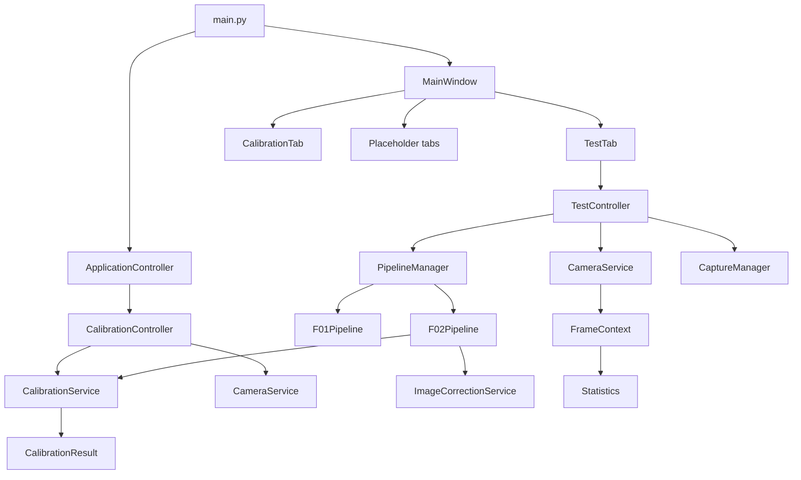
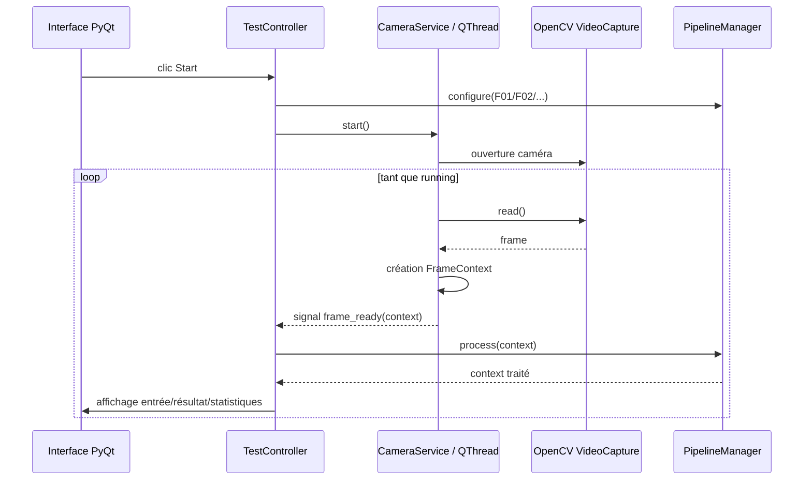
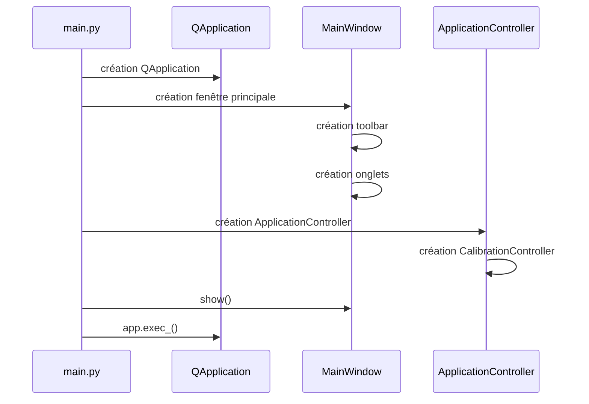
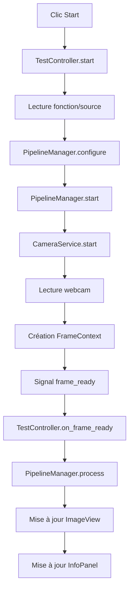
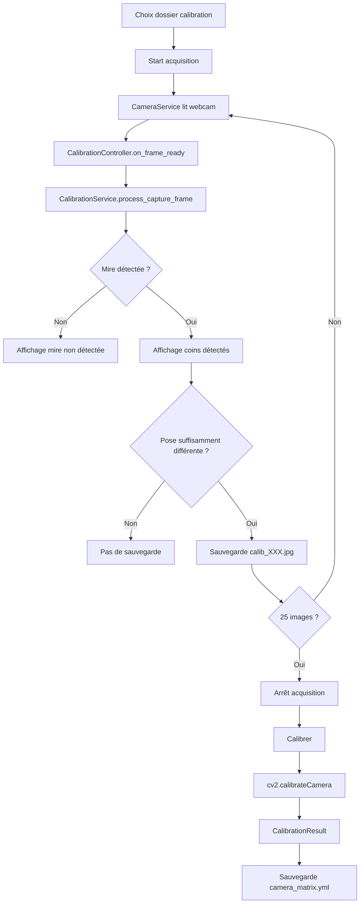
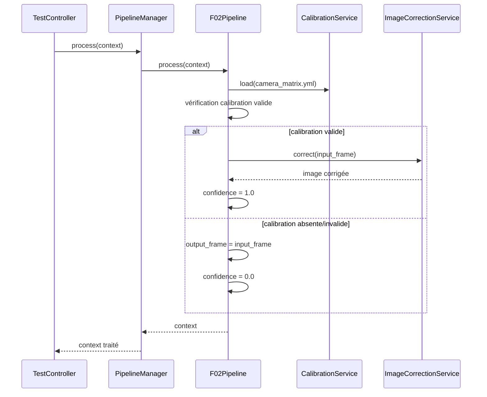
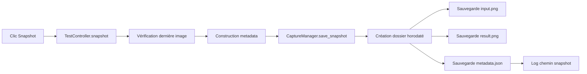
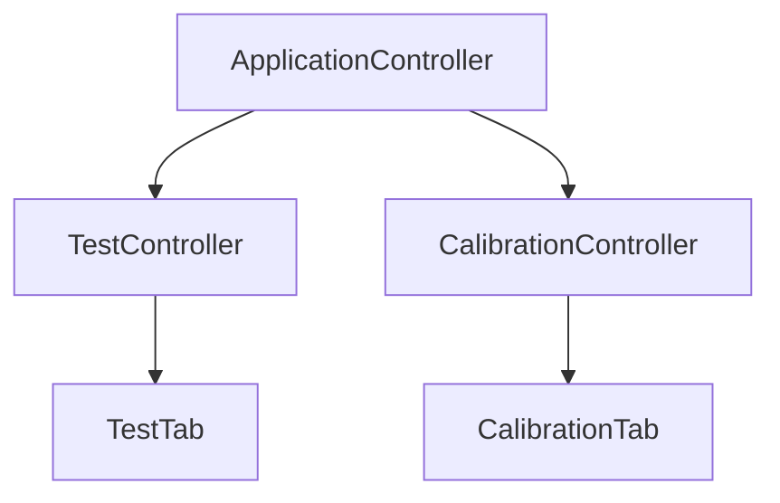
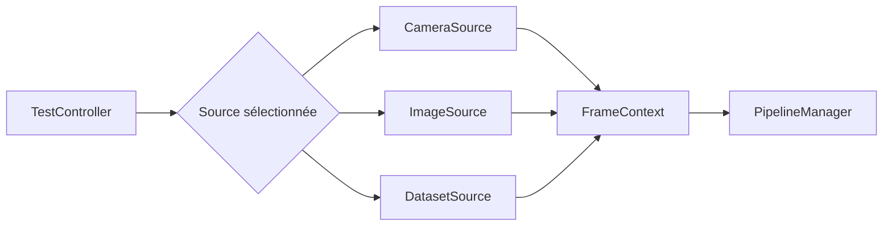
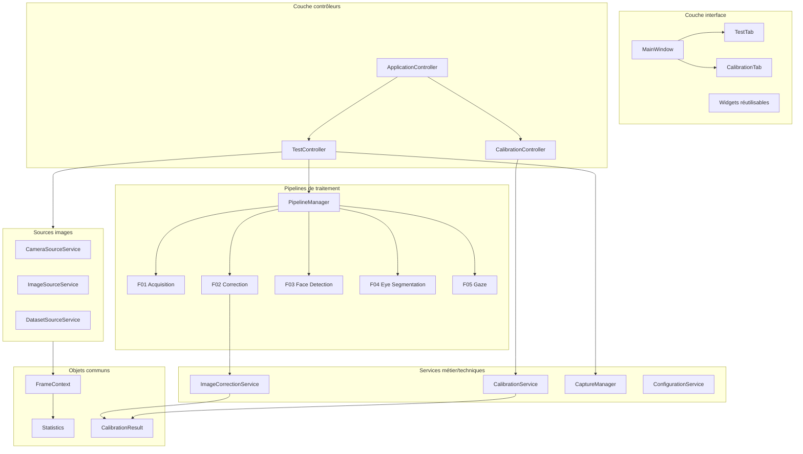

# Architecture logicielle détaillée — GG Eye Tracking Test Bench

## 1. Objectif du logiciel

Ce projet est une application de banc de test développée en Python avec PyQt5 et OpenCV. Son objectif est de fournir une interface graphique permettant de tester différentes fonctions liées au traitement vidéo et à la vision par ordinateur, notamment :

- l'acquisition vidéo depuis une webcam ;
- la calibration caméra à partir d'une mire de type échiquier ;
- la correction de distorsion d'image ;
- la préparation de futures fonctions de détection de visage, segmentation des yeux, calcul de trajectoire du regard, optimisation et simulation cloud.

L'application est organisée comme un logiciel modulaire. Les traitements sont regroupés dans des services et des pipelines, tandis que l'interface graphique reste principalement responsable de l'affichage et de la récupération des actions utilisateur.

---

## 2. Vue d'ensemble de l'architecture

L'architecture globale peut être décrite comme une architecture de type **MVC enrichie par une couche Services et une couche Pipelines**.

- **Views** : composants PyQt5 visibles par l'utilisateur.
- **Controllers** : orchestration entre interface graphique, services et pipelines.
- **Services** : logique technique ou métier réutilisable, par exemple acquisition caméra, calibration, sauvegarde de captures.
- **Pipelines** : chaînes de traitement appliquées aux images.
- **Core** : structures de données communes échangées entre les couches.
- **Resources** : fichiers de calibration, images de mire et ressources externes.
- **Captures** : sorties générées par le logiciel lors des snapshots.



---

## 3. Organisation des dossiers

```text
main_src/
├── main.py
├── controllers/
│   ├── application_controller.py
│   ├── calibration_controller.py
│   └── test_controller.py
├── core/
│   ├── calibration_result.py
│   ├── frame_context.py
│   └── statistics.py
├── models/
│   └── test_model.py
├── pipelines/
│   ├── base_pipeline.py
│   ├── f01_pipeline.py
│   ├── f02_pipeline.py
│   ├── f03_pipeline.py
│   ├── f04_pipeline.py
│   └── f05_pipeline.py
├── services/
│   ├── calibration_service.py
│   ├── camera_service.py
│   ├── capture_manager.py
│   ├── image_correction_service.py
│   └── pipeline_manager.py
├── views/
│   ├── main_window.py
│   ├── test_tab.py
│   ├── calibration_tab.py
│   ├── placeholder_tab.py
│   └── widgets/
│       ├── control_panel.py
│       ├── image_view.py
│       ├── info_panel.py
│       └── log_panel.py
├── resources/
│   └── calibration/
│       ├── camera_matrix.yml
│       └── calib_imgs/
└── captures/
    └── YYYYMMDD_HHMMSS/
        ├── input.png
        ├── result.png
        └── metadata.json
```

---

## 4. Rôle des couches logicielles

## 4.1 Couche Views

La couche `views` contient les éléments graphiques PyQt5. Elle construit les fenêtres, les onglets, les boutons, les zones d'image, les panneaux d'information et les logs.

Elle ne devrait idéalement pas contenir de logique métier complexe. Son rôle principal est :

- afficher les images d'entrée et de sortie ;
- afficher les informations fonctionnelles ;
- exposer des boutons et menus ;
- transmettre les actions utilisateur aux contrôleurs via les signaux Qt ;
- afficher les messages de log.

### Composants principaux

| Fichier | Rôle |
|---|---|
| `views/main_window.py` | Fenêtre principale, barre d'outils et onglets. |
| `views/test_tab.py` | Onglet de test des fonctions F01 à F07. |
| `views/calibration_tab.py` | Onglet dédié à la calibration caméra. |
| `views/placeholder_tab.py` | Onglets temporaires pour les fonctions non encore développées. |
| `views/widgets/control_panel.py` | Sélection fonction/source et boutons Start/Stop/Snapshot/Batch. |
| `views/widgets/image_view.py` | Affichage d'une image OpenCV dans un widget PyQt5. |
| `views/widgets/info_panel.py` | Affichage des informations de traitement. |
| `views/widgets/log_panel.py` | Console de log horodatée. |

---

## 4.2 Couche Controllers

La couche `controllers` relie les actions utilisateur aux traitements. Elle fait le lien entre les vues et les services.

Un contrôleur :

- connecte les signaux PyQt aux méthodes applicatives ;
- déclenche les services nécessaires ;
- met à jour l'interface avec les résultats ;
- maintient l'état courant d'une fonctionnalité.

### `ApplicationController`

`ApplicationController` est le contrôleur global de l'application. Il reçoit la fenêtre principale et initialise notamment le contrôleur de calibration.

Responsabilités :

- conserver l'onglet actif ;
- mettre à jour la barre de statut lors d'un changement d'onglet ;
- instancier le contrôleur de calibration.

Ce contrôleur joue le rôle de coordinateur global, mais il reste léger.

### `CalibrationController`

`CalibrationController` pilote tout le scénario de calibration caméra.

Responsabilités :

- sélectionner un dossier de mires ;
- démarrer une session d'acquisition caméra ;
- recevoir les images depuis `CameraService` ;
- demander à `CalibrationService` de détecter la mire ;
- sauvegarder automatiquement les images utiles ;
- lancer le calcul de calibration ;
- sauvegarder la matrice caméra dans `camera_matrix.yml` ;
- tester la correction de distorsion sur une image.

Il orchestre donc une séquence complète : webcam → détection mire → sauvegarde images → calcul calibration → sauvegarde résultat.

### `TestController`

Il existe deux fichiers contenant un `TestController` :

- `controllers/test_controller.py` ;
- `tests/test_calibration.py`.

Dans l'état actuel du projet, `views/test_tab.py` importe `TestController` depuis `tests.test_calibration`, ce qui est probablement une anomalie d'architecture. Le dossier `tests` devrait normalement contenir des tests automatisés, pas le contrôleur utilisé par l'application.

Le rôle attendu de `TestController` est :

- lire la fonction sélectionnée dans l'interface ;
- configurer le pipeline correspondant ;
- démarrer ou arrêter la webcam ;
- recevoir chaque `FrameContext` depuis `CameraService` ;
- appliquer le pipeline courant ;
- afficher l'image d'entrée et l'image résultat ;
- mettre à jour les statistiques ;
- sauvegarder un snapshot avec `CaptureManager`.

Recommandation : déplacer ou conserver le contrôleur actif dans `controllers/test_controller.py`, puis corriger l'import dans `views/test_tab.py`.

---

## 4.3 Couche Services

La couche `services` contient les traitements techniques réutilisables. Elle évite de mélanger la logique OpenCV, caméra, fichiers ou calibration directement avec les vues.

### `CameraService`

`CameraService` est un service d'acquisition vidéo basé sur `QThread`. Il lit les images depuis OpenCV avec `cv2.VideoCapture`.

Responsabilités :

- ouvrir la caméra ;
- lire les frames en boucle ;
- calculer quelques statistiques d'acquisition ;
- encapsuler chaque image dans un `FrameContext` ;
- émettre un signal `frame_ready` vers le contrôleur ;
- émettre les changements d'état via `status_changed` ;
- fermer proprement la caméra.

Le choix d'utiliser un `QThread` est important : l'acquisition vidéo ne bloque pas l'interface graphique. Sans thread séparé, l'IHM pourrait se figer pendant la lecture caméra.



### `CalibrationService`

`CalibrationService` concentre toute la logique OpenCV de calibration.

Responsabilités :

- gérer une session de capture de mires ;
- détecter une mire de type échiquier ;
- convertir le nombre de cases imprimées en nombre de coins internes OpenCV ;
- filtrer les images capturées pour éviter de sauvegarder trop d'images similaires ;
- analyser un dossier d'images ;
- calculer la matrice caméra et les coefficients de distorsion ;
- sauvegarder/charger la calibration depuis un fichier YAML ;
- corriger une image par `cv2.undistort`.

Point important : le service distingue les **cases imprimées** et les **coins internes OpenCV**. Par exemple, une mire imprimée 9 x 7 cases correspond à 8 x 6 coins internes pour OpenCV.

### `ImageCorrectionService`

`ImageCorrectionService` applique une correction de distorsion à une image à partir d'un `CalibrationResult`.

Responsabilités :

- recevoir ou mettre à jour une calibration ;
- vérifier que la calibration est valide ;
- retourner l'image originale si aucune calibration valide n'est disponible ;
- appliquer `cv2.undistort` si la calibration est valide.

Ce service est volontairement simple et réutilisable. Il est utilisé par `F02Pipeline`.

### `PipelineManager`

`PipelineManager` sélectionne et pilote le pipeline actif.

Responsabilités :

- instancier le pipeline correspondant à la fonction sélectionnée ;
- démarrer le pipeline ;
- arrêter le pipeline ;
- transmettre le `FrameContext` au pipeline courant.

Actuellement, seuls `F01Pipeline` et `F02Pipeline` sont réellement branchés. Les autres fonctions visibles dans l'interface sont prévues mais pas encore intégrées.

### `CaptureManager`

`CaptureManager` gère la sauvegarde des snapshots.

Lorsqu'un snapshot est demandé, il crée un dossier horodaté dans `captures/`, puis écrit :

- `input.png` : image d'entrée ;
- `result.png` : image résultat ;
- `metadata.json` : contexte de la capture.

Cette séparation est intéressante car elle permet de garder une trace reproductible des essais.

---

## 4.4 Couche Pipelines

Les pipelines représentent les traitements appliqués aux images.

Chaque pipeline hérite normalement de `BasePipeline` et expose une méthode `process()`.

### `BasePipeline`

`BasePipeline` définit l'interface commune :

- un nom ;
- un état `running` ;
- une méthode `start()` ;
- une méthode `stop()` ;
- une méthode abstraite `process()` ;
- une méthode `get_statistics()`.

L'objectif est de pouvoir remplacer ou ajouter facilement une fonction de traitement sans modifier fortement les contrôleurs.

### `F01Pipeline` — Acquisition

`F01Pipeline` est le pipeline le plus simple. Il reçoit le `FrameContext`, renseigne le nom du pipeline et mesure un temps de traitement minimal.

Il ne transforme pas réellement l'image. L'image d'entrée et l'image de sortie restent identiques.

Usage : valider que l'acquisition caméra, l'affichage et le flux logiciel fonctionnent.

### `F02Pipeline` — Correction d'image

`F02Pipeline` charge une calibration depuis `resources/calibration/camera_matrix.yml`, puis utilise `ImageCorrectionService` pour corriger la distorsion.

Comportement :

- si une calibration valide est disponible, `output_frame` reçoit l'image corrigée ;
- sinon, `output_frame` reste égale à `input_frame` ;
- la confiance vaut `1.0` si la calibration est valide, `0.0` sinon ;
- le temps de traitement est mesuré.

Ce pipeline est le premier vrai exemple de chaîne de traitement exploitable.

### `F03Pipeline`, `F04Pipeline`, `F05Pipeline`

Ces pipelines sont encore incomplets.

- `F03Pipeline` retourne actuellement directement l'image reçue.
- `F04Pipeline` fait référence à `BasePipeline` sans import visible et utilise `self.segmenter`, qui n'est pas instancié.
- `F05Pipeline` est vide.

Ils doivent être considérés comme des emplacements réservés pour les futures fonctions : détection visage, segmentation des yeux, calcul du regard.

---

## 4.5 Couche Core

La couche `core` définit les objets de données partagés entre les composants.

### `FrameContext`

`FrameContext` est l'objet central du flux vidéo. Il transporte une image et ses métadonnées pendant tout le traitement.

Il contient notamment :

- `input_frame` : image brute reçue depuis la caméra ;
- `output_frame` : image produite par le pipeline ;
- `timestamp` : date/heure de la frame ;
- `frame_number` : numéro de frame ;
- `width`, `height` : résolution ;
- `pipeline_name` : pipeline appliqué ;
- `faces`, `eyes`, `gaze` : résultats prévus pour les futures fonctions de vision ;
- `statistics` : objet `Statistics` associé.

Ce choix est pertinent car il évite de passer un grand nombre de paramètres entre les fonctions. Toute l'information d'une frame circule dans un seul objet.

### `Statistics`

`Statistics` contient les mesures de performance et de résultat.

Exemples :

- temps d'acquisition ;
- temps de traitement ;
- temps d'affichage ;
- temps total ;
- FPS ;
- confiance ;
- nombre de visages ;
- nombre d'yeux ;
- statistiques CPU/GPU/RAM prévues.

Cette classe prépare une future supervision plus complète du banc de test.

### `CalibrationResult`

`CalibrationResult` encapsule le résultat de calibration :

- matrice caméra ;
- coefficients de distorsion ;
- erreur RMS ;
- taille d'image ;
- taille de pattern détecté.

La méthode `is_valid()` permet de vérifier rapidement si la calibration peut être utilisée.

---

## 5. Flux principaux

## 5.1 Démarrage de l'application



Étapes :

1. `main.py` crée l'application Qt.
2. `MainWindow` construit l'IHM principale.
3. Les onglets Tests, Calibration, Dataset, Optimisation, Cloud et Logs sont ajoutés.
4. `ApplicationController` est instancié.
5. L'application entre dans la boucle événementielle Qt.

---

## 5.2 Flux d'acquisition vidéo dans l'onglet Tests



Ce flux montre le comportement typique du banc de test :

- l'utilisateur choisit une fonction ;
- le pipeline correspondant est sélectionné ;
- la webcam démarre ;
- chaque image est encapsulée dans un `FrameContext` ;
- le pipeline traite le contexte ;
- l'IHM affiche le résultat.

---

## 5.3 Flux de calibration caméra



La calibration repose sur plusieurs images de mire. Le logiciel évite de sauvegarder des images trop proches en position grâce au calcul du centre moyen des coins détectés.

---

## 5.4 Flux de correction d'image



---

## 5.5 Flux de snapshot



Le snapshot permet de conserver un essai complet : image source, image résultat et contexte fonctionnel.

---

## 6. Gestion des données

## 6.1 Données temps réel

Les données temps réel transitent principalement par `FrameContext`.

```text
CameraService
    ↓
FrameContext(input_frame, output_frame, stats, timestamp, résolution)
    ↓
PipelineManager
    ↓
Pipeline actif
    ↓
FrameContext enrichi
    ↓
TestController
    ↓
Views
```

## 6.2 Données persistantes

Les données persistantes sont stockées sous forme de fichiers :

| Type | Emplacement | Format |
|---|---|---|
| Images de calibration | `resources/calibration/calib_imgs/` | `.jpg` |
| Calibration caméra | `resources/calibration/camera_matrix.yml` | YAML OpenCV |
| Snapshots | `captures/YYYYMMDD_HHMMSS/` | PNG + JSON |

## 6.3 Fichier de calibration

Le fichier `camera_matrix.yml` contient :

- `K` : matrice intrinsèque caméra ;
- `D` : coefficients de distorsion ;
- `rms` : erreur RMS ;
- `image_width`, `image_height` ;
- `pattern_width`, `pattern_height`.

Ce fichier est lu par `CalibrationService.load()` et utilisé par `F02Pipeline`.

---

## 7. Communication entre composants

La communication repose sur deux mécanismes principaux.

### 7.1 Signaux PyQt

Les signaux Qt sont utilisés pour découpler les actions utilisateur et l'acquisition caméra.

Exemples :

- bouton Start → signal `start_clicked` ;
- bouton Stop → signal `stop_clicked` ;
- `CameraService.frame_ready` → réception d'une nouvelle image ;
- `CameraService.status_changed` → affichage d'un message caméra.

### 7.2 Appels directs Python

Les contrôleurs appellent directement les services :

- `CalibrationController` appelle `CalibrationService` ;
- `TestController` appelle `PipelineManager` ;
- `PipelineManager` appelle le pipeline actif ;
- `F02Pipeline` appelle `ImageCorrectionService`.

Cette combinaison est classique pour une application PyQt : signaux pour les événements, appels directs pour la logique applicative.

---

## 8. Responsabilités détaillées par composant

## 8.1 `main.py`

Point d'entrée de l'application.

Responsabilités :

- créer `QApplication` ;
- créer `MainWindow` ;
- créer `ApplicationController` ;
- afficher la fenêtre ;
- lancer la boucle événementielle.

## 8.2 `MainWindow`

Fenêtre principale.

Responsabilités :

- définir le titre et la taille ;
- créer la toolbar ;
- créer les onglets ;
- placer les onglets au centre.

## 8.3 `ControlPanel`

Panneau de commande de l'onglet Tests.

Responsabilités :

- proposer la liste des fonctions F01 à F07 ;
- proposer la source : Webcam, Image ou Dataset ;
- exposer les boutons Start, Stop, Snapshot, Batch ;
- convertir les clics boutons en signaux applicatifs.

## 8.4 `ImageView`

Widget d'affichage d'image.

Responsabilités :

- convertir une image OpenCV BGR en RGB ;
- convertir l'image en `QImage` ;
- créer un `QPixmap` ;
- adapter l'affichage à la taille du widget ;
- afficher une ligne d'information sous l'image.

## 8.5 `InfoPanel`

Panneau d'information fonctionnelle.

Responsabilités :

- afficher la fonction active ;
- afficher la source active ;
- afficher modèle, backend, résolution, temps, FPS, confiance et état.

## 8.6 `LogPanel`

Console de logs.

Responsabilités :

- afficher les messages horodatés ;
- fournir une méthode `append()` simple pour tous les contrôleurs.

---

## 9. État actuel des fonctionnalités

| Fonction | État actuel | Commentaire |
|---|---:|---|
| F01 Acquisition vidéo | Fonctionnelle | Acquisition webcam + affichage. |
| F02 Calibration / correction | Partiellement fonctionnelle | Correction via fichier calibration existant. Calibration complète dans onglet dédié. |
| F03 Détection visage | Squelette | Pipeline présent mais non intégré dans `PipelineManager`. |
| F04 Segmentation yeux | Non fonctionnelle | Import manquant et segmenter non instancié. |
| F05 Trajectoire regard | Vide | À développer. |
| F06 Optimisation | Placeholder interface | Pas de pipeline connecté. |
| F07 Cloud/AWS simulation | Placeholder interface | Pas de pipeline connecté. |
| Source Webcam | Fonctionnelle | Via `CameraService`. |
| Source Image | Non implémentée | Message utilisateur seulement. |
| Source Dataset | Non implémentée | Message utilisateur seulement. |
| Snapshot | Fonctionnel | Sauvegarde input/result/metadata. |
| Batch | Non implémenté | Log seulement. |

---

## 10. Points d'attention techniques

## 10.1 Import du contrôleur de test

Dans `views/test_tab.py`, l'import actuel est :

```python
from tests.test_calibration import TestController
```

C'est problématique car :

- `tests` devrait contenir des tests unitaires ou fonctionnels ;
- le contrôleur applicatif devrait venir de `controllers/test_controller.py` ;
- cela crée une confusion entre code produit et code de test.

Recommandation :

```python
from controllers.test_controller import TestController
```

Puis supprimer ou renommer `tests/test_calibration.py` si ce fichier n'est pas un vrai test automatisé.

## 10.2 Interface des pipelines incomplète

`BasePipeline.process()` indique `process(self, frame)`, mais les pipelines F01/F02 utilisent plutôt `process(self, context)`.

Recommandation : uniformiser toute l'architecture autour de `FrameContext` :

```python
def process(self, context: FrameContext) -> FrameContext:
    ...
```

Cela rendra l'interface claire pour tous les pipelines.

## 10.3 Pipelines F03/F04/F05 incomplets

`F04Pipeline` utilise `BasePipeline` sans import et fait appel à `self.segmenter` sans l'initialiser.

Recommandation : marquer explicitement les pipelines non prêts avec un comportement sûr :

```python
class F04Pipeline(BasePipeline):
    def process(self, context):
        context.output_frame = context.input_frame
        context.statistics.confidence = 0.0
        return context
```

## 10.4 Attribut dynamique `statistics.calibrated`

Dans `F02Pipeline`, le code ajoute dynamiquement :

```python
context.statistics.calibrated = True
```

Or cet attribut n'est pas déclaré dans la dataclass `Statistics`.

Python l'accepte, mais ce n'est pas idéal pour la lisibilité et la maintenance.

Recommandation : ajouter officiellement le champ dans `Statistics` :

```python
calibrated: bool = False
```

## 10.5 Chargement calibration dans `F02Pipeline`

`F02Pipeline` charge la calibration lors de son instanciation. C'est simple, mais si le fichier `camera_matrix.yml` est modifié pendant que le logiciel tourne, le pipeline ne le recharge pas automatiquement sauf s'il est recréé.

Recommandation possible :

- recharger la calibration au démarrage du pipeline ;
- ou ajouter un bouton/événement de rechargement ;
- ou injecter un `CalibrationService` partagé.

## 10.6 Typo dans le nom du pipeline F02

Le nom actuel contient une faute :

```python
"F02 Correction des iamges"
```

Correction recommandée :

```python
"F02 Correction des images"
```

---

## 11. Qualités de conception déjà présentes

Le projet possède plusieurs choix intéressants :

- séparation claire entre interface, contrôleurs, services et pipelines ;
- utilisation d'un objet `FrameContext` pour transporter les données ;
- acquisition caméra dans un thread séparé ;
- encapsulation des résultats de calibration dans une dataclass ;
- sauvegarde structurée des snapshots ;
- architecture extensible vers de nouvelles fonctions F03 à F07 ;
- interface graphique déjà pensée pour comparer image d'entrée et image résultat ;
- logs intégrés dans l'IHM ;
- dossiers de ressources et de captures séparés.

Ces éléments donnent une base saine pour transformer le prototype en application plus robuste.

---

## 12. Recommandations d'évolution

## 12.1 Stabiliser l'architecture MVC

Actions recommandées :

1. Mettre tous les contrôleurs applicatifs dans `controllers/`.
2. Garder `tests/` uniquement pour les tests unitaires.
3. Éviter qu'une vue instancie directement un contrôleur si possible.
4. Faire instancier tous les contrôleurs par `ApplicationController`.

Architecture cible :



## 12.2 Créer un registre de pipelines

Au lieu d'une série de `if/elif`, utiliser un dictionnaire :

```python
PIPELINES = {
    "F01": F01Pipeline,
    "F02": F02Pipeline,
    "F03": F03Pipeline,
}
```

Avantages :

- ajout plus simple de nouvelles fonctions ;
- code plus lisible ;
- possibilité d'afficher automatiquement les fonctions disponibles.

## 12.3 Ajouter des sources Image et Dataset

Actuellement, seule la webcam est réellement implémentée.

Il serait utile d'ajouter :

- `ImageSourceService` pour traiter une image unique ;
- `DatasetSourceService` pour rejouer un dossier d'images ;
- une interface commune `SourceService`.

Architecture cible :



## 12.4 Renforcer les tests automatisés

Créer de vrais tests dans `tests/` :

- test de création `FrameContext` ;
- test `CalibrationResult.is_valid()` ;
- test `PipelineManager.configure()` ;
- test `CaptureManager.save_snapshot()` avec dossier temporaire ;
- test de chargement/sauvegarde calibration.

## 12.5 Ajouter une configuration externe

Plusieurs valeurs sont codées en dur :

- index caméra `0` ;
- chemin calibration ;
- nombre d'images `25` ;
- dimensions de mire `9 x 7` ;
- taille de carré `0.025` ;
- `frame_skip`.

Un fichier de configuration permettrait d'adapter le logiciel sans modifier le code :

```yaml
camera:
  index: 0

calibration:
  directory: resources/calibration/calib_imgs
  matrix_file: resources/calibration/camera_matrix.yml
  board_width: 9
  board_height: 7
  square_size: 0.025
  max_images: 25
```

## 12.6 Mieux gérer les erreurs

Aujourd'hui, beaucoup d'erreurs sont simplement affichées dans le log. C'est suffisant pour un prototype, mais une version robuste pourrait ajouter :

- exceptions spécifiques ;
- messages utilisateur plus explicites ;
- désactivation des boutons incompatibles ;
- statut visuel caméra active/inactive ;
- vérification au démarrage de la présence d'OpenCV, PyQt5 et du fichier calibration.

---

## 13. Architecture cible proposée

Voici une architecture cible possible pour la suite du projet :



---

## 14. Synthèse

Le logiciel est déjà structuré sur une base modulaire cohérente : interface PyQt5, contrôleurs, services, pipelines et objets de données communs.

La partie la plus avancée concerne :

- l'acquisition webcam ;
- la calibration caméra ;
- la correction de distorsion ;
- l'affichage comparatif entrée/résultat ;
- la sauvegarde de snapshots.

Les principales améliorations à court terme sont :

1. corriger l'import du `TestController` ;
2. unifier l'interface des pipelines autour de `FrameContext` ;
3. compléter ou sécuriser les pipelines F03/F04/F05 ;
4. externaliser la configuration ;
5. ajouter des tests automatisés ;
6. implémenter les sources Image et Dataset ;
7. centraliser davantage l'instanciation des contrôleurs dans `ApplicationController`.

Avec ces évolutions, le projet pourra passer d'un banc de test fonctionnel à une architecture plus maintenable, extensible et transmissible à d'autres développeurs.
